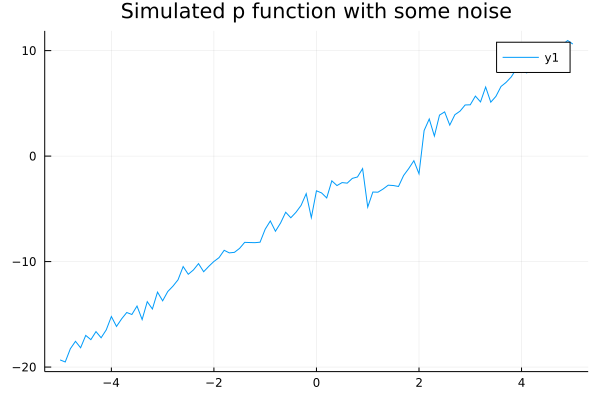
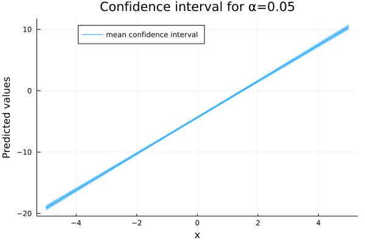
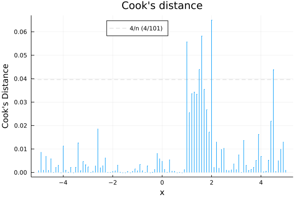

# Examples

```@meta
DocTestSetup = quote
    using CategoricalArrays, DataFrames, Distributions, GLM, RDatasets
end
```

## Linear regression
```jldoctest
julia> using DataFrames, GLM

julia> data = DataFrame(X=[1,2,3], Y=[2,4,7])
3×2 DataFrames.DataFrame
│ Row │ X     │ Y     │
│     │ Int64 │ Int64 │
├─────┼───────┼───────┤
│ 1   │ 1     │ 2     │
│ 2   │ 2     │ 4     │
│ 3   │ 3     │ 7     │

julia> ols = lm(@formula(Y ~ X), data)
StatsModels.DataFrameRegressionModel{LinearModel{LmResp{Array{Float64,1}},DensePredChol{Float64,LinearAlgebra.Cholesky{Float64,Array{Float64,2}}}},Array{Float64,2}}

Formula: Y ~ 1 + X

Coefficients:
─────────────────────────────────────────────────────────────────────────
                 Coef.  Std. Error      t  Pr(>|t|)  Lower 95%  Upper 95%
─────────────────────────────────────────────────────────────────────────
(Intercept)  -0.666667    0.62361   -1.07    0.4788   -8.59038    7.25704
X             2.5         0.288675   8.66    0.0732   -1.16797    6.16797
─────────────────────────────────────────────────────────────────────────

julia> round.(stderror(ols), digits=5)
2-element Array{Float64,1}:
 0.62361
 0.28868

julia> round.(predict(ols), digits=5)
3-element Array{Float64,1}:
 1.83333
 4.33333
 6.83333
```

## Probit regression
```jldoctest
julia> data = DataFrame(X=[1,2,2], Y=[1,0,1])
3×2 DataFrames.DataFrame
│ Row │ X     │ Y     │
│     │ Int64 │ Int64 │
├─────┼───────┼───────┤
│ 1   │ 1     │ 1     │
│ 2   │ 2     │ 0     │
│ 3   │ 2     │ 1     │

julia> probit = glm(@formula(Y ~ X), data, Binomial(), ProbitLink())
StatsModels.DataFrameRegressionModel{GeneralizedLinearModel{GlmResp{Array{Float64,1},Binomial{Float64},ProbitLink},DensePredChol{Float64,LinearAlgebra.Cholesky{Float64,Array{Float64,2}}}},Array{Float64,2}}

Formula: Y ~ 1 + X

Coefficients:
────────────────────────────────────────────────────────────────────────
                Coef.  Std. Error      z  Pr(>|z|)  Lower 95%  Upper 95%
────────────────────────────────────────────────────────────────────────
(Intercept)   9.63839     293.909   0.03    0.9738   -566.414    585.69
X            -4.81919     146.957  -0.03    0.9738   -292.849    283.211
────────────────────────────────────────────────────────────────────────
```

## Negative binomial regression
```jldoctest
julia> using GLM, RDatasets

julia> quine = dataset("MASS", "quine")
146×5 DataFrames.DataFrame
│ Row │ Eth          │ Sex          │ Age          │ Lrn          │ Days  │
│     │ Categorical… │ Categorical… │ Categorical… │ Categorical… │ Int32 │
├─────┼──────────────┼──────────────┼──────────────┼──────────────┼───────┤
│ 1   │ A            │ M            │ F0           │ SL           │ 2     │
│ 2   │ A            │ M            │ F0           │ SL           │ 11    │
│ 3   │ A            │ M            │ F0           │ SL           │ 14    │
│ 4   │ A            │ M            │ F0           │ AL           │ 5     │
│ 5   │ A            │ M            │ F0           │ AL           │ 5     │
│ 6   │ A            │ M            │ F0           │ AL           │ 13    │
│ 7   │ A            │ M            │ F0           │ AL           │ 20    │
⋮
│ 139 │ N            │ F            │ F3           │ AL           │ 22    │
│ 140 │ N            │ F            │ F3           │ AL           │ 3     │
│ 141 │ N            │ F            │ F3           │ AL           │ 3     │
│ 142 │ N            │ F            │ F3           │ AL           │ 5     │
│ 143 │ N            │ F            │ F3           │ AL           │ 15    │
│ 144 │ N            │ F            │ F3           │ AL           │ 18    │
│ 145 │ N            │ F            │ F3           │ AL           │ 22    │
│ 146 │ N            │ F            │ F3           │ AL           │ 37    │

julia> nbrmodel = glm(@formula(Days ~ Eth+Sex+Age+Lrn), quine, NegativeBinomial(2.0), LogLink())
StatsModels.DataFrameRegressionModel{GeneralizedLinearModel{GlmResp{Array{Float64,1},NegativeBinomial{Float64},LogLink},DensePredChol{Float64,LinearAlgebra.Cholesky{Float64,Array{Float64,2}}}},Array{Float64,2}}

Formula: Days ~ 1 + Eth + Sex + Age + Lrn

Coefficients:
────────────────────────────────────────────────────────────────────────────
                  Coef.  Std. Error      z  Pr(>|z|)   Lower 95%   Upper 95%
────────────────────────────────────────────────────────────────────────────
(Intercept)   2.88645      0.227144  12.71    <1e-36   2.44125     3.33164
Eth: N       -0.567515     0.152449  -3.72    0.0002  -0.86631    -0.26872
Sex: M        0.0870771    0.159025   0.55    0.5840  -0.224606    0.398761
Age: F1      -0.445076     0.239087  -1.86    0.0627  -0.913678    0.0235251
Age: F2       0.0927999    0.234502   0.40    0.6923  -0.366816    0.552416
Age: F3       0.359485     0.246586   1.46    0.1449  -0.123814    0.842784
Lrn: SL       0.296768     0.185934   1.60    0.1105  -0.0676559   0.661191
────────────────────────────────────────────────────────────────────────────

julia> nbrmodel = negbin(@formula(Days ~ Eth+Sex+Age+Lrn), quine, LogLink())
StatsModels.DataFrameRegressionModel{GeneralizedLinearModel{GlmResp{Array{Float64,1},NegativeBinomial{Float64},LogLink},DensePredChol{Float64,LinearAlgebra.Cholesky{Float64,Array{Float64,2}}}},Array{Float64,2}}

Formula: Days ~ 1 + Eth + Sex + Age + Lrn

Coefficients:
────────────────────────────────────────────────────────────────────────────
                  Coef.  Std. Error      z  Pr(>|z|)   Lower 95%   Upper 95%
────────────────────────────────────────────────────────────────────────────
(Intercept)   2.89453      0.227415  12.73    <1e-36   2.4488      3.34025
Eth: N       -0.569341     0.152656  -3.73    0.0002  -0.868541   -0.270141
Sex: M        0.0823881    0.159209   0.52    0.6048  -0.229655    0.394431
Age: F1      -0.448464     0.238687  -1.88    0.0603  -0.916281    0.0193536
Age: F2       0.0880506    0.235149   0.37    0.7081  -0.372834    0.548935
Age: F3       0.356955     0.247228   1.44    0.1488  -0.127602    0.841513
Lrn: SL       0.292138     0.18565    1.57    0.1156  -0.0717297   0.656006
────────────────────────────────────────────────────────────────────────────

julia> println("Estimated theta = ", round(nbrmodel.model.rr.d.r, digits=5))
Estimated theta = 1.27489

```

## Julia and R comparisons

An example of a simple linear model in R is
```r
> coef(summary(lm(optden ~ carb, Formaldehyde)))
               Estimate  Std. Error    t value     Pr(>|t|)
(Intercept) 0.005085714 0.007833679  0.6492115 5.515953e-01
carb        0.876285714 0.013534536 64.7444207 3.409192e-07
```
The corresponding model with the `GLM` package is

```jldoctest
julia> using GLM, RDatasets

julia> form = dataset("datasets", "Formaldehyde")
6×2 DataFrame
│ Row │ Carb     │ OptDen   │
│     │ Float64⍰ │ Float64⍰ │
├─────┼──────────┼──────────┤
│ 1   │ 0.1      │ 0.086    │
│ 2   │ 0.3      │ 0.269    │
│ 3   │ 0.5      │ 0.446    │
│ 4   │ 0.6      │ 0.538    │
│ 5   │ 0.7      │ 0.626    │
│ 6   │ 0.9      │ 0.782    │

julia> lm1 = fit(LinearModel, @formula(OptDen ~ Carb), form)
StatsModels.DataFrameRegressionModel{LinearModel{LmResp{Array{Float64,1}},DensePredChol{Float64,LinearAlgebra.Cholesky{Float64,Array{Float64,2}}}},Array{Float64,2}}

Formula: OptDen ~ 1 + Carb

───────────────────────────────────────────────────────────────────────────
                  Coef.  Std. Error      t  Pr(>|t|)   Lower 95%  Upper 95%
───────────────────────────────────────────────────────────────────────────
(Intercept)  0.00508571  0.00783368   0.65    0.5516  -0.0166641  0.0268355
Carb         0.876286    0.0135345   64.74    <1e-6    0.838708   0.913864
───────────────────────────────────────────────────────────────────────────
```

A more complex example in R is
```r
> coef(summary(lm(sr ~ pop15 + pop75 + dpi + ddpi, LifeCycleSavings)))
                 Estimate   Std. Error    t value     Pr(>|t|)
(Intercept) 28.5660865407 7.3545161062  3.8841558 0.0003338249
pop15       -0.4611931471 0.1446422248 -3.1885098 0.0026030189
pop75       -1.6914976767 1.0835989307 -1.5609998 0.1255297940
dpi         -0.0003369019 0.0009311072 -0.3618293 0.7191731554
ddpi         0.4096949279 0.1961971276  2.0881801 0.0424711387
```
with the corresponding Julia code
```jldoctest
julia> LifeCycleSavings = dataset("datasets", "LifeCycleSavings")
50×6 DataFrame
│ Row │ Country        │ SR       │ Pop15    │ Pop75    │ DPI      │ DDPI     │
│     │ String⍰        │ Float64⍰ │ Float64⍰ │ Float64⍰ │ Float64⍰ │ Float64⍰ │
├─────┼────────────────┼──────────┼──────────┼──────────┼──────────┼──────────┤
│ 1   │ Australia      │ 11.43    │ 29.35    │ 2.87     │ 2329.68  │ 2.87     │
│ 2   │ Austria        │ 12.07    │ 23.32    │ 4.41     │ 1507.99  │ 3.93     │
│ 3   │ Belgium        │ 13.17    │ 23.8     │ 4.43     │ 2108.47  │ 3.82     │
│ 4   │ Bolivia        │ 5.75     │ 41.89    │ 1.67     │ 189.13   │ 0.22     │
│ 5   │ Brazil         │ 12.88    │ 42.19    │ 0.83     │ 728.47   │ 4.56     │
│ 6   │ Canada         │ 8.79     │ 31.72    │ 2.85     │ 2982.88  │ 2.43     │
│ 7   │ Chile          │ 0.6      │ 39.74    │ 1.34     │ 662.86   │ 2.67     │
⋮
│ 43  │ United Kingdom │ 7.81     │ 23.27    │ 4.46     │ 1813.93  │ 2.01     │
│ 44  │ United States  │ 7.56     │ 29.81    │ 3.43     │ 4001.89  │ 2.45     │
│ 45  │ Venezuela      │ 9.22     │ 46.4     │ 0.9      │ 813.39   │ 0.53     │
│ 46  │ Zambia         │ 18.56    │ 45.25    │ 0.56     │ 138.33   │ 5.14     │
│ 47  │ Jamaica        │ 7.72     │ 41.12    │ 1.73     │ 380.47   │ 10.23    │
│ 48  │ Uruguay        │ 9.24     │ 28.13    │ 2.72     │ 766.54   │ 1.88     │
│ 49  │ Libya          │ 8.89     │ 43.69    │ 2.07     │ 123.58   │ 16.71    │
│ 50  │ Malaysia       │ 4.71     │ 47.2     │ 0.66     │ 242.69   │ 5.08     │

julia> fm2 = fit(LinearModel, @formula(SR ~ Pop15 + Pop75 + DPI + DDPI), LifeCycleSavings)
StatsModels.DataFrameRegressionModel{LinearModel{LmResp{Array{Float64,1}},DensePredChol{Float64,LinearAlgebra.Cholesky{Float64,Array{Float64,2}}}},Array{Float64,2}}

Formula: SR ~ 1 + Pop15 + Pop75 + DPI + DDPI

Coefficients:
─────────────────────────────────────────────────────────────────────────────────
                    Coef.   Std. Error      t  Pr(>|t|)    Lower 95%    Upper 95%
─────────────────────────────────────────────────────────────────────────────────
(Intercept)  28.5661       7.35452       3.88    0.0003  13.7533      43.3788
Pop15        -0.461193     0.144642     -3.19    0.0026  -0.752518    -0.169869
Pop75        -1.6915       1.0836       -1.56    0.1255  -3.87398      0.490983
DPI          -0.000336902  0.000931107  -0.36    0.7192  -0.00221225   0.00153844
DDPI          0.409695     0.196197      2.09    0.0425   0.0145336    0.804856
─────────────────────────────────────────────────────────────────────────────────
```

The `glm` function (or equivalently, `fit(GeneralizedLinearModel, ...)`)
works similarly to the R `glm` function except that the `family`
argument is replaced by a `Distribution` type and, optionally, a `Link` type.
The first example from `?glm` in R is

```r
glm> ## Dobson (1990) Page 93: Randomized Controlled Trial : (slightly modified)
glm> counts <- c(18,17,15,20,10,21,25,13,13)

glm> outcome <- gl(3,1,9)

glm> treatment <- gl(3,3)

glm> print(d.AD <- data.frame(treatment, outcome, counts))
  treatment outcome counts
1         1       1     18
2         1       2     17
3         1       3     15
4         2       1     20
5         2       2     10
6         2       3     21
7         3       1     25
8         3       2     13
9         3       3     13

glm> glm.D93 <- glm(counts ~ outcome + treatment, family=poisson())

glm> anova(glm.D93)
Analysis of Deviance Table

Model: poisson, link: log

Response: counts

Terms added sequentially (first to last)


          Df Deviance Resid. Df Resid. Dev
NULL                          8    10.3928
outcome    2   5.2622         6     5.1307
treatment  2   0.0132         4     5.1175

glm> ## No test:
glm> summary(glm.D93)

Call:
glm(formula = counts ~ outcome + treatment, family = poisson())

Deviance Residuals: 
      1        2        3        4        5        6        7        8        9  
-0.6122   1.0131  -0.2819  -0.2498  -0.9784   1.0777   0.8162  -0.1155  -0.8811  

Coefficients:
            Estimate Std. Error z value Pr(>|z|)    
(Intercept)   3.0313     0.1712  17.711   <2e-16 ***
outcome2     -0.4543     0.2022  -2.247   0.0246 *  
outcome3     -0.2513     0.1905  -1.319   0.1870    
treatment2    0.0198     0.1990   0.100   0.9207    
treatment3    0.0198     0.1990   0.100   0.9207    
---
Signif. codes:  0 '***' 0.001 '**' 0.01 '*' 0.05 '.' 0.1 ' ' 1

(Dispersion parameter for poisson family taken to be 1)

    Null deviance: 10.3928  on 8  degrees of freedom
Residual deviance:  5.1175  on 4  degrees of freedom
AIC: 56.877

Number of Fisher Scoring iterations: 4
```
In Julia this becomes
```jldoctest
julia> using DataFrames, CategoricalArrays, GLM

julia> dobson = DataFrame(Counts    = [18.,17,15,20,10,21,25,13,13],
                          Outcome   = categorical([1,2,3,1,2,3,1,2,3]),
                          Treatment = categorical([1,1,1,2,2,2,3,3,3]))
9×3 DataFrame
│ Row │ Counts  │ Outcome      │ Treatment    │
│     │ Float64 │ Categorical… │ Categorical… │
├─────┼─────────┼──────────────┼──────────────┤
│ 1   │ 18.0    │ 1            │ 1            │
│ 2   │ 17.0    │ 2            │ 1            │
│ 3   │ 15.0    │ 3            │ 1            │
│ 4   │ 20.0    │ 1            │ 2            │
│ 5   │ 10.0    │ 2            │ 2            │
│ 6   │ 21.0    │ 3            │ 2            │
│ 7   │ 25.0    │ 1            │ 3            │
│ 8   │ 13.0    │ 2            │ 3            │
│ 9   │ 13.0    │ 3            │ 3            │


julia> gm1 = fit(GeneralizedLinearModel, @formula(Counts ~ Outcome + Treatment), dobson, Poisson())
StatsModels.DataFrameRegressionModel{GeneralizedLinearModel{GlmResp{Array{Float64,1},Poisson{Float64},LogLink},DensePredChol{Float64,LinearAlgebra.Cholesky{Float64,Array{Float64,2}}}},Array{Float64,2}}

Formula: Counts ~ 1 + Outcome + Treatment

Coefficients:
────────────────────────────────────────────────────────────────────────────
                   Coef.  Std. Error      z  Pr(>|z|)  Lower 95%   Upper 95%
────────────────────────────────────────────────────────────────────────────
(Intercept)    3.03128      0.171155  17.71    <1e-69   2.69582    3.36674
Outcome: 2    -0.454255     0.202171  -2.25    0.0246  -0.850503  -0.0580079
Outcome: 3    -0.251314     0.190476  -1.32    0.1870  -0.624641   0.122012
Treatment: 2   0.0198026    0.199017   0.10    0.9207  -0.370264   0.409869
Treatment: 3   0.0198026    0.199017   0.10    0.9207  -0.370264   0.409869
────────────────────────────────────────────────────────────────────────────

julia> round(deviance(gm1), digits=5)
5.11746
```
## Using Cook's distance
It is possible to calculate Cook's distance on a fitted Linear Model, and this gives an estimate of the influence of each data point. More information about Cook's distance can be found on Wikipedia (https://en.wikipedia.org/wiki/Cook%27s_distance) or relevant papers authored by R Dennis Cook himself such as: https://conservancy.umn.edu/handle/11299/199280.

Here we are only going to illustrate how the distance can be used to identify regions of the design space which require more attention.

### Data creation through simulation
Let's create a function p(x) that is linear on the major part of the region of interest. 

```julia
f(x) = @. 3x - 4  # linear function 
h(x) = @. x^2 - 5 # non linear but relatively close to f when x is between 1 and 2
p(x) = (x < 1 || x > 2) ? f.(x) : h.(x) # piecewise function
```
Let's plot p(x):
```julia
x = -5:0.1:5
display(plot(x, p.(x), xlabel="x", ylabel="y", legend=false, title="True p function"))
```


Now let's assume that observing/simulating `p(x)` add some noise (distributed according to a Normal distribution). Which we can model as: 
```julia
simulated(f, x, ϵ) = f.(x) .+ rand(Normal(0, ϵ), length(x))
```
and collect some data in a DataFrame in an interval/region of interest.

```julia
simulated(f, x, ϵ) = f.(x) .+ rand(Normal(0, ϵ), length(x))

data = DataFrame(x=collect(x), y=simulated(p, x, 0.5))
display(@df data plot(:x, :y, title="simulated p function with some noise"))

```


### Linear Regression

Now we can do the linear regression on the collected data using the GLM package.
```julia
ols = lm(@formula(y ~ 1 + x), df)
@show(ols)
@show(r2(ols))
```
which outputs:
```
y ~ 1 + x

Coefficients:
─────────────────────────────────────────────────────────────────────────
                Coef.  Std. Error       t  Pr(>|t|)  Lower 95%  Upper 95%
─────────────────────────────────────────────────────────────────────────
(Intercept)  -4.32483   0.0970727  -44.55    <1e-66   -4.51744   -4.13222
x             2.93773   0.0332957   88.23    <1e-95    2.87167    3.0038
─────────────────────────────────────────────────────────────────────────
r2(ols) = 0.9874426347136959
```
Indicating an extremely good fit, which is to be expected given how we created the data. We can contrast this output to the output resulting from the simulated function f alone. 

```julia
dataf = DataFrame(x=collect(x), y=simulated(f, x, 0.5))
olsf = lm(@formula(y ~ 1 + x), dataf)
@show(olsf)
@show(r2(olsf))
```
which would output:
```
y ~ 1 + x

Coefficients:
─────────────────────────────────────────────────────────────────────────
                Coef.  Std. Error       t  Pr(>|t|)  Lower 95%  Upper 95%
─────────────────────────────────────────────────────────────────────────
(Intercept)  -4.02288   0.0525136  -76.61    <1e-89   -4.12708   -3.91869
x             3.00479   0.018012   166.82    <1e-99    2.96905    3.04053
─────────────────────────────────────────────────────────────────────────
r2(olsf) = 0.9964552085765462
0.9964552085765462
```
Which gives similar results. Indeed the estimates for x and the intercept are closer to the truth but we know that only because we know how the data was made.

We could try to investigate the confidence interval for the mean of the predictions on the region of interest.

```julia
pred = predict(ols, data, interval=:confidence)
plot(x, pred.prediction, label="prediction")
plot!(x, pred.lower, label="lower")
plot!(x, pred.upper, label="lower", legend=:top)
```
Which outputs:


And because of the nature of the confidence interval, this will not give much information for our current purpose.

### Using Cook's distance

Plotting the results of the cooks distance: 

```julia
function plot_x_cooksdistance(x, cooksd)
	scatter(x, cooksd, label=false, ms=0, xlabel="x", ylabel="Cook's Distance") # I did not find a better way not to have a marker.
	hline!([4 / length(x)], color=:lightgray, ls=:dash, label="4/n (4/$(length(x)))")
	for i in 1:length(x)
		plot!([x[i], x[i]], [0, cooksd[i]], label=false, color=1)
	end
	plot!(legend=:top)
end
plot_x_cooksdistance(data.x, data.cooksd)
```
will output the following:



This gives us a view of which observations are influential and are impacting the estimation of coefficients resulting from the linear regression. Because the plotting follows the interval of interest, it is possible to understand which zone of our interval requires more attention (here between 1 and 2).

The plotting works well here because we have univariate data. In the context of higher dimensions, it may be useful to either make a plot per dimension or to combine two-dimension through some heatmap.
In this plot, the "threshold" of n/4 with n the number of observations, is only used to enhance the display and ease the visual inspection, and not as a strict threshold.

